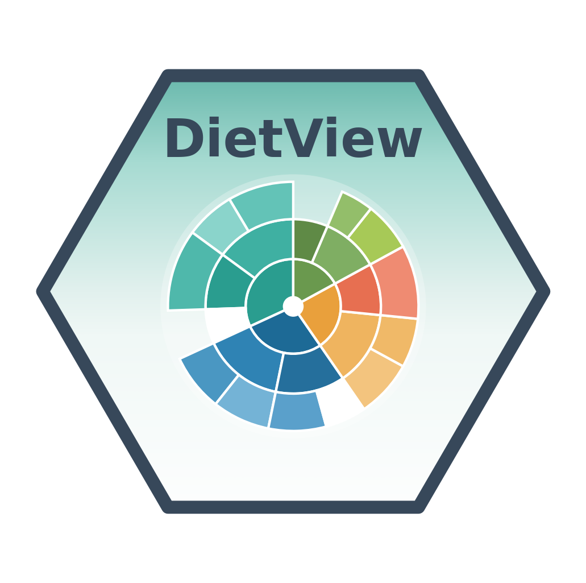

# DietView 

> Taxonomically complete, covariate-aware visualization of predator diet

<!-- badges: start -->
[](https://sosthenea.r-universe.dev/DietView)
[](https://github.com/SostheneA/DietView/actions/workflows/R-CMD-check.yaml)
[](https://sosthenea.github.io/DietView/)
[](https://lifecycle.r-lib.org/articles/stages.html#experimental)
[](https://opensource.org/licenses/MIT)
<!-- badges: end -->

**DietView** turns a plain long table of stomach-content records — predator,
stomach, prey, weight, covariates, *without any taxonomy* — into interactive,
taxonomically complete **sunburst** views of predator diet. It **adds the taxa
itself** (from [WoRMS](https://www.marinespecies.org/) by AphiaID/name, or from a
lineage table you supply), computes per-taxon relative importance in
**occurrence** and **weight** as the share *within each taxonomic rank*, keeps
unidentified prey as an explicit **NA** category, lets any covariate stratify the
views, quantifies the **digestion** identification bias, and **deploys** a
self-contained HTML dashboard. See the [documentation
site](https://sosthenea.github.io/DietView/).

## Table of contents

- [Overview](#overview)
- [Documentation](#documentation)
- [Installation](#installation)
- [Basic use](#basic-use)
- [The explicit-NA philosophy](#the-explicit-na-philosophy)
- [Function reference](#function-reference)
- [Input format](#input-format)
- [Getting help](#getting-help)
- [Citation](#citation)
- [Related work](#related-work)

## Overview

DietView is built around a single input contract — *one row per prey record in a
stomach* — and one reusable specification object. From there it offers:

- **taxonomy on demand**: resolve prey against WoRMS by AphiaID (preferred) or
  name, following unaccepted names to their valid AphiaID, with an exact-then-
  fuzzy strategy and a full provenance log; or join a lineage table for a fully
  offline, reproducible run;
- **within-rank importance** in two currencies (occurrence and weight), where
  every taxonomic rank sums to 100 % and unidentified prey is an explicit **NA**
  category rather than a silently dropped row;
- **covariate stratification** by any user-declared columns (period, year, size
  class, length bins, region, …), plus helpers to derive periods and length bins;
- a **digestion identification-bias diagnostic** that shows how the finest
  resolved rank shifts toward coarse ranks as digestion advances;
- **interactive sunbursts** (plotly) with a fixed orientation so covariate cells
  are directly comparable, and a stable colour dictionary across ranks;
- three **outputs**: a [Shiny](https://shiny.posit.co/) explorer, a
  self-contained HTML dashboard (searchable/sortable predator cards with
  auto-fetched ID photos), or plain plotly figures.
- **exploration & reproducible aggregation**: sample summaries,
  prey-accumulation curves for sampling sufficiency, classical per-rank
  frequency of occurrence, threshold-based aggregation that collapses rare prey
  upward to a reproducible resolution (pooled, cross-predator, and per-predator),
  and a sampling-unit by prey-category matrix export for multivariate analysis.

## Documentation

Everything lives on the **[documentation site](https://sosthenea.github.io/DietView/)**.
Several articles are rendered end-to-end on the bundled example, so the tables and
sunbursts you see there are real output.

**Start here**

| | Article | What it covers |
|---|---|---|
| 1 | [Getting started](https://sosthenea.github.io/DietView/articles/dietview.html) | the whole pipeline, end to end, offline |
| 2 | [Data model & input contract](https://sosthenea.github.io/DietView/articles/data-model.html) | one row per prey record; mapping your columns |

**Core concepts**

| | Article | What it covers |
|---|---|---|
| 3 | [Within-rank importance & explicit NA](https://sosthenea.github.io/DietView/articles/within-rank-na.html) | why each rank sums to 100 %, NA included |
| 4 | [Covariate stratification](https://sosthenea.github.io/DietView/articles/covariates.html) | periods, size bins, and crossing two covariates |
| 5 | [Digestion identification bias](https://sosthenea.github.io/DietView/articles/digestion.html) | how identification degrades with digestion |
| 6 | [WoRMS taxonomy](https://sosthenea.github.io/DietView/articles/taxonomy-worms.html) | matching, provenance, and reviewing fuzzy hits |
| 7 | [Exploring & aggregating diet data](https://sosthenea.github.io/DietView/articles/exploration.html) | sample summary, prey-accumulation, true %FO, threshold aggregation, set x category matrix |

**Outputs & extension**

| | Article | What it covers |
|---|---|---|
| 8 | [Self-contained dashboard](https://sosthenea.github.io/DietView/articles/dashboard.html) | bands, strata, crossed rows, one file to ship |
| 9 | [Species identification cards](https://sosthenea.github.io/DietView/articles/species-cards.html) | photos, descriptions, offline mode |
| 10 | [Interactive Shiny explorer](https://sosthenea.github.io/DietView/articles/shiny-app.html) | pooled or per-predator, faceted and crossed |
| 11 | [Adapting DietView to your survey](https://sosthenea.github.io/DietView/articles/extending.html) | custom ranks, colours, offline taxonomy |

> ### 📘 Technical reference — the package companion
> The full narrative of **what DietView contains and why**: design principles,
> architecture, data structures, and every function with its internal logic.
> Distinct from the journal article (which argues *why* the package matters) and
> from the [function reference](https://sosthenea.github.io/DietView/reference/index.html)
> (the API).
>
> **[Read it online](https://sosthenea.github.io/DietView/articles/technical-reference.html)**

## Installation

DietView is distributed through [R-universe](https://r-universe.dev):

```r
install.packages("DietView",
  repos = c("https://sosthenea.r-universe.dev", "https://cloud.r-project.org"))
```

Or install the development version from GitHub:

```r
# install.packages("pak")
pak::pak("SostheneA/DietView")
```

Optional features need a few more packages: `worrms` (WoRMS taxonomy),
`shiny` + `DT` (interactive app), `rmarkdown` (self-contained HTML).

```r
install.packages(c("worrms", "shiny", "DT", "rmarkdown"))
```

## Basic use

A minimal, fully offline workflow using the bundled example (base long table +
a lineage lookup, so no internet is required):

```r
library(DietView)

# 1. base long table: predator, stomach, prey, weight, covariates -- NO taxonomy
dat <- read.csv(
  system.file("extdata", "dietview_example.csv", package = "DietView"),
  na.strings = c("NA", "")
)

# 2. declare column roles once (nothing is hard-coded)
spec <- dv_spec(
  predator       = "predator_species_common_name",
  predator_latin = "predator_species_latin_name",
  stomach        = "stomach_id",
  prey_id        = "aphia_id",
  prey_name      = "verified_name",
  weight         = "prey_weight",
  digestion      = "digestion_level_id",
  covariates     = c("period", "size_class", "size_bin", "region")
)

# 3. attach taxonomy -- offline via a lineage table ...
lin  <- read.csv(
  system.file("extdata", "dietview_example_lineage.csv", package = "DietView"),
  na.strings = c("NA", "")
)
prep <- dv_prepare(dat, spec, taxonomy = "table", lineage = lin)

#    ... or live from WoRMS (needs 'worrms' + internet; results are cached):
# prep <- dv_prepare(dat, spec, taxonomy = "worms")

# 4. metrics: within-rank importance (NA included; each rank sums to 100 %)
tree <- dv_build_tree(prep$data, prep$ranks, weight_col = spec$weight)
dv_rank_table(tree, "Class")

# 5. figures + digestion diagnostic
dv_sunburst(tree, mode = "occurrence", title = "All predators")
dv_digestion_diagnostic(prep, by = "period")

# 6. explore, check sampling sufficiency, aggregate, and export
dv_summary(prep)                                  # stomachs, records, taxa per predator
dv_prey_accumulation(prep, permutations = 50)     # cumulative prey curve
dv_fo_table(prep, rank = "class")                 # classical per-rank %FO

agg  <- dv_aggregate_threshold(prep, threshold = 100)   # collapse rare prey upward
m    <- dv_matrix(agg, currency = "occurrence")         # set x category matrix (-> vegan)

# 7. deploy a standalone HTML dashboard (like the sGSL one)
dv_deploy(prep, file = "dietview_dashboard.html", dir = "outputs",
          strata = c("period", "size_class", "size_bin"),
          cross  = list(c("size_bin", "period")),
          length_col = "somatic_length_cm")

# or explore interactively
run_dietview(prep)
```

See [Getting started with
DietView](https://sosthenea.github.io/DietView/articles/dietview.html) for the
rendered walk-through.

## The explicit-NA philosophy

Where identification stops — or WoRMS has no finer rank — DietView keeps the
deeper rank columns as `NA` and shows them as an explicit **"NA"** category
(white in the sunburst). Two consequences follow:

- within-rank percentages still sum to **100 %**, so nothing is quietly rebased
  onto the identified fraction only;
- identification gaps stay **visible** instead of being hidden inside a
  functional grouping.

The digestion diagnostic makes this concrete: as digestion advances, mass shifts
from Species toward the coarse ranks and "Unresolved", which is exactly the bias
you want to see rather than smooth over.

## Function reference

| Step | Functions |
|---|---|
| declare & validate | [`dv_spec()`](https://sosthenea.github.io/DietView/reference/dv_spec.html), [`dv_validate()`](https://sosthenea.github.io/DietView/reference/dv_validate.html) |
| attach taxonomy | [`dv_prepare()`](https://sosthenea.github.io/DietView/reference/dv_prepare.html), [`dv_taxonomy_worms()`](https://sosthenea.github.io/DietView/reference/dv_taxonomy_worms.html), [`dv_taxonomy_report()`](https://sosthenea.github.io/DietView/reference/dv_taxonomy_report.html) |
| covariates | [`dv_add_period()`](https://sosthenea.github.io/DietView/reference/dv_add_period.html), [`dv_size_bins()`](https://sosthenea.github.io/DietView/reference/dv_size_bins.html) |
| metrics | [`dv_build_tree()`](https://sosthenea.github.io/DietView/reference/dv_build_tree.html), [`dv_rank_table()`](https://sosthenea.github.io/DietView/reference/dv_rank_table.html) |
| figures | [`dv_sunburst()`](https://sosthenea.github.io/DietView/reference/dv_sunburst.html), [`dv_palette()`](https://sosthenea.github.io/DietView/reference/dv_palette.html) |
| digestion bias | [`dv_digestion_diagnostic()`](https://sosthenea.github.io/DietView/reference/dv_digestion_diagnostic.html) |
| species cards | [`dv_species_card_assets()`](https://sosthenea.github.io/DietView/reference/dv_species_card_assets.html) |
| dashboards & app | [`dv_build_html()`](https://sosthenea.github.io/DietView/reference/dv_build_html.html), [`dv_deploy()`](https://sosthenea.github.io/DietView/reference/dv_deploy.html), [`run_dietview()`](https://sosthenea.github.io/DietView/reference/run_dietview.html) |
| explore & aggregate | [`dv_summary()`](https://sosthenea.github.io/DietView/reference/dv_summary.html), [`dv_prey_accumulation()`](https://sosthenea.github.io/DietView/reference/dv_prey_accumulation.html), [`dv_fo_table()`](https://sosthenea.github.io/DietView/reference/dv_fo_table.html), [`dv_aggregate_threshold()`](https://sosthenea.github.io/DietView/reference/dv_aggregate_threshold.html), [`dv_threshold_sweep()`](https://sosthenea.github.io/DietView/reference/dv_threshold_sweep.html), [`dv_matrix()`](https://sosthenea.github.io/DietView/reference/dv_matrix.html) |

## Input format

One row = **one prey record in one stomach**. Column names are free; you map them
to DietView roles once via `dv_spec()`. The bundled data dictionary
(`inst/extdata/dietview_data_dictionary.md`) documents the example files
`dietview_example.csv` (base table) and `dietview_example_lineage.csv` (lineage
lookup).

## Getting help

For bugs or feature requests, please use the [issue
tracker](https://github.com/SostheneA/DietView/issues).

## Citation

```r
citation("DietView")
```

## Related work

DietView is a visualization and reporting layer; it does not model diet
composition or fit selectivity. It complements diet-analysis workflows built on
`vegan` (multivariate community statistics) — to which `dv_matrix()` is the
direct bridge — the WoRMS toolchain (`worrms`), and interactive graphics via
`plotly` and `htmlwidgets`. The sunburst and dashboard
design follow the southern Gulf of St. Lawrence (sGSL) diet dashboard it
generalizes.
