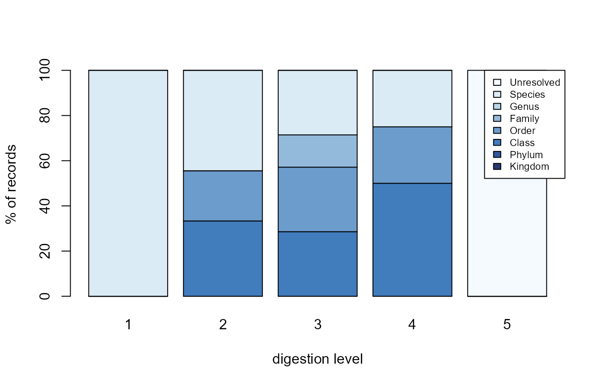

# The digestion identification bias

Diet identification is not uniform: heavily digested prey can only be
resolved to coarse ranks. If that bias is hidden, a diet description
silently over-represents whatever is easy to identify.
[`dv_digestion_diagnostic()`](https://sosthenea.github.io/DietView/reference/dv_digestion_diagnostic.md)
makes it explicit.

``` r
library(DietView)

dat <- read.csv(system.file("extdata", "dietview_example.csv", package = "DietView"),
                na.strings = c("NA", ""))
lin <- read.csv(system.file("extdata", "dietview_example_lineage.csv", package = "DietView"),
                na.strings = c("NA", ""))
spec <- dv_spec(predator = "predator_species_common_name", stomach = "stomach_id",
                prey_id = "aphia_id", prey_name = "verified_name",
                weight = "prey_weight", digestion = "digestion_level_id",
                covariates = c("period"))
prep <- dv_prepare(dat, spec, taxonomy = "table", lineage = lin)
```

## The diagnostic

For each digestion level, the share of records (and of weight) whose
**finest resolved rank** is Kingdom, Phylum, …, Species, or Unresolved:

``` r
diag <- dv_digestion_diagnostic(prep)
head(diag, 12)
#>    digestion finest_rank n_records  weight p_records     p_weight
#> 1          1     Species         2  9.0020 100.00000 1.000000e+02
#> 2          2       Class         3  0.5128  33.33333 1.433491e+00
#> 3          2       Order         2  0.1100  22.22222 3.074962e-01
#> 4          2     Species         4 35.1500  44.44444 9.825901e+01
#> 5          3       Class         2  0.2010  28.57143 9.662997e-01
#> 6          3       Order         2  0.4500  28.57143 2.163358e+00
#> 7          3      Family         1  0.0500  14.28571 2.403731e-01
#> 8          3     Species         2 20.1000  28.57143 9.662997e+01
#> 9          4       Class         2  8.0200  50.00000 8.003193e+01
#> 10         4       Order         1  2.0000  25.00000 1.995809e+01
#> 11         4     Species         1  0.0010  25.00000 9.979044e-03
#> 12         5  Unresolved         2  1.6000 100.00000 1.000000e+02
```

## Reading the bias

As the digestion level increases, mass shifts away from Species toward
the coarse ranks and “Unresolved”. A dependency-free stacked bar makes
the shift visible:

``` r
m <- xtabs(p_records ~ finest_rank + digestion, data = diag)
barplot(m, col = grDevices::hcl.colors(nrow(m), "Blues"),
        legend.text = TRUE,
        args.legend = list(x = "topright", cex = 0.7, bg = "white"),
        xlab = "digestion level", ylab = "% of records")
```



## Splitting by a covariate

Pass `by =` to see whether the bias differs across, say, periods:

``` r
head(dv_digestion_diagnostic(prep, by = "period"), 12)
#>    digestion        by finest_rank n_records  weight p_records    p_weight
#> 1          1 2004-2006     Species         1  0.0020 100.00000 100.0000000
#> 2          1 2018-2019     Species         1  9.0000 100.00000 100.0000000
#> 3          2 2004-2006       Class         3  0.5128  60.00000   3.7670428
#> 4          2 2004-2006     Species         2 13.1000  40.00000  96.2329572
#> 5          2 2018-2019       Order         2  0.1100  50.00000   0.4963899
#> 6          2 2018-2019     Species         2 22.0500  50.00000  99.5036101
#> 7          3 2004-2006       Class         2  0.2010  50.00000   3.7563072
#> 8          3 2004-2006      Family         1  0.0500  25.00000   0.9344048
#> 9          3 2004-2006     Species         1  5.1000  25.00000  95.3092880
#> 10         3 2018-2019       Order         2  0.4500  66.66667   2.9126214
#> 11         3 2018-2019     Species         1 15.0000  33.33333  97.0873786
#> 12         4 2004-2006       Class         1  8.0000  50.00000  80.0000000
```

Making this bias visible is the point: it is exactly the information a
functional prey grouping would smooth over.
